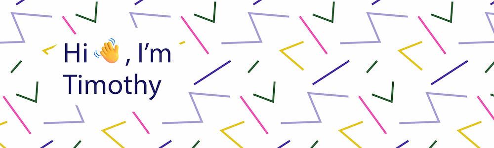

# 

## About

Junior Frontend Developer, interested in web-performance and a11y issues. Currently work in [klerk](https://www.klerk.ru/).  
You can view my stats in [GitLab](http://gitlabnew.klerk-team.ru/timothy7310)

## Stack

## Stats

## Codewars

## Projects

